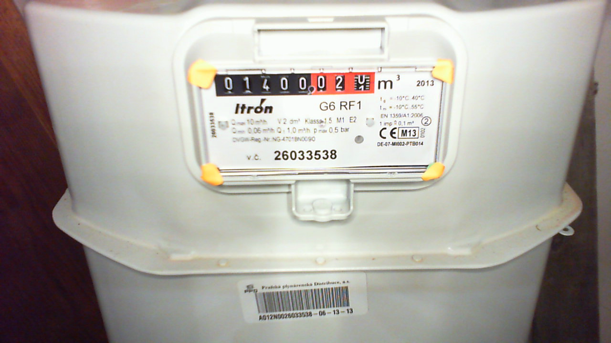
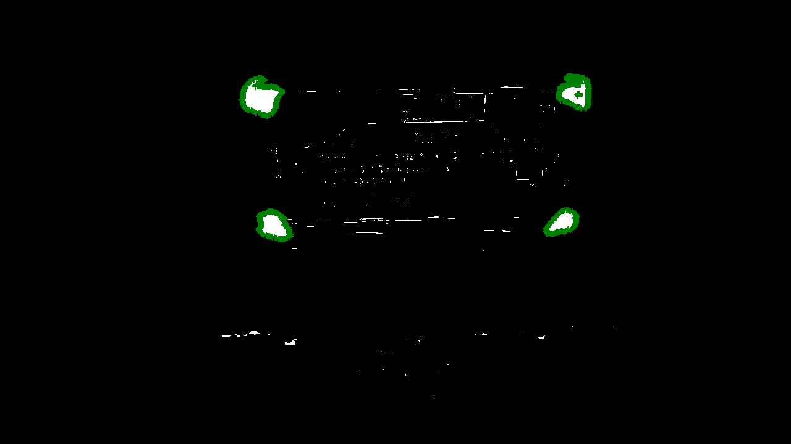
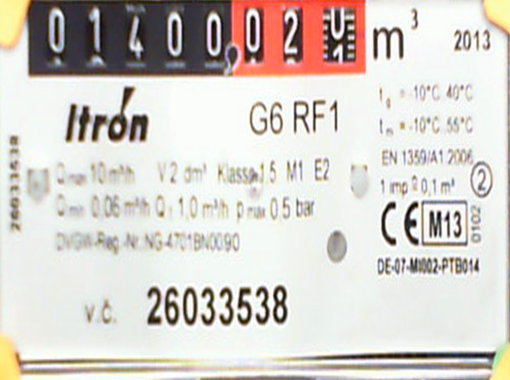
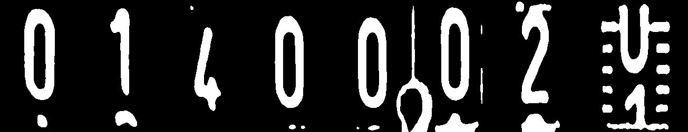
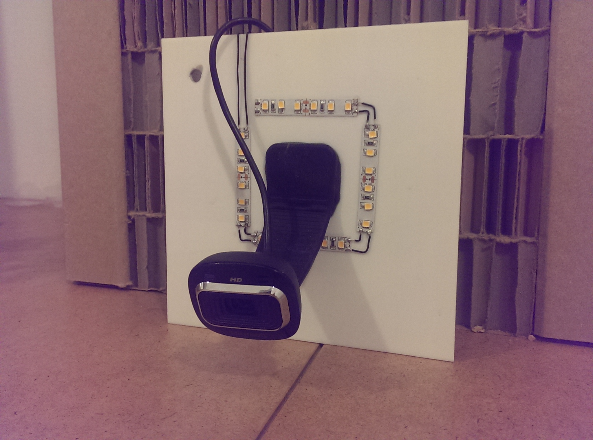
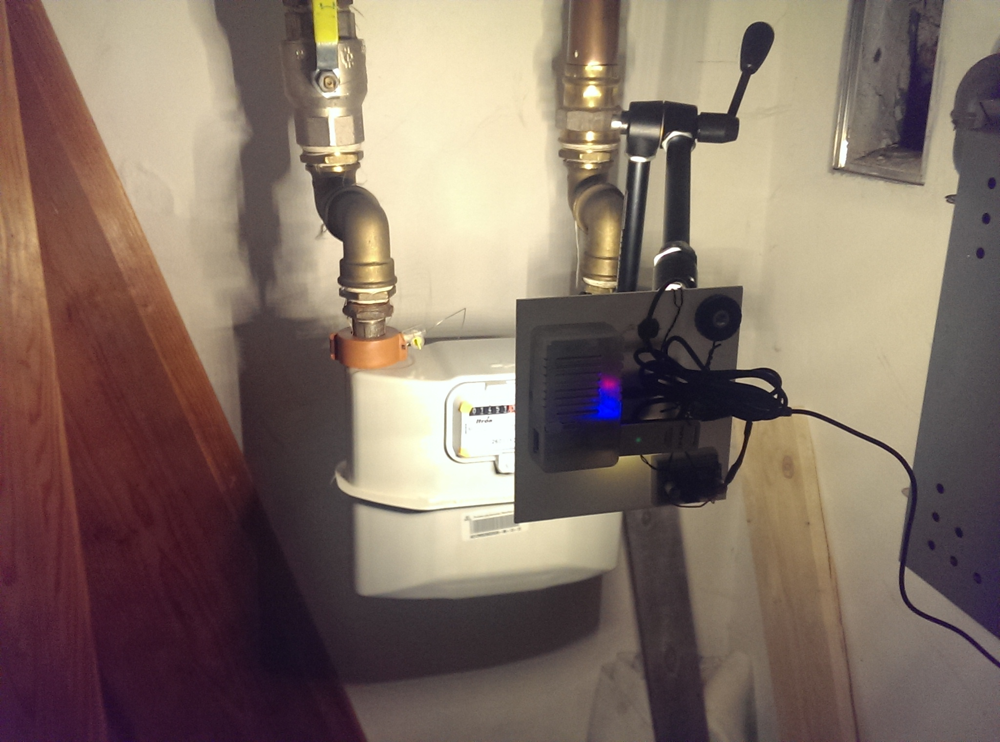

# Gas measurement in Paralelni Polis

## Why

 *Work in progress...*

## Getting things ready
    sudo apt-get install ipython python-opencv python-scipy python-numpy python-pygame python-setuptools python-pip
    sudo pip install https://github.com/sightmachine/SimpleCV/zipball/develop
    sudo pip install svgwrite
    git clone git@github.com:ParalelniPolis/ppplyn.git
    cd ppplyn

## Test image recognition on images included in repository

## How does it work

### Source image

### Marker detection

### Gas meter with fixed perspective

### Digits

### Digits in black and white

### Single digits

   

## Physical setup

* ODROID-U3
* Microsoft LifeCam HD-3000
* 3D printed cover from [MakerLab](http://makerslab.cz/) *TBC*
* LED strips
* Tons of epoxy glue

 