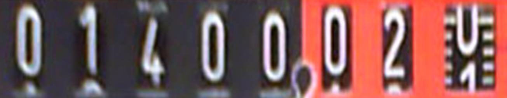

# Gas measurement in Paralelni Polis

## Why

 *Work in progress...*

## Getting things ready
    sudo apt-get install ipython python-opencv python-scipy python-numpy python-pygame python-setuptools python-pip python-sklearn
    sudo pip install https://github.com/sightmachine/SimpleCV/zipball/develop
    sudo pip install svgwrite
    git clone git@github.com:ParalelniPolis/ppplyn.git
    cd ppplyn

## Test image recognition on images included in repository
    ./test.py
    ./images/input/camera_1449323843.png	1474.652
    ./images/input/camera_1449323833.png	1474.648
    ./images/input/camera_1449323854.png	1474.657
    ./images/input/camera_1449323901.png	1474.678
    ./images/input/camera_1449323870.png	1474.664
    ./images/input/camera_1449323822.png	1474.643
    ./images/input/camera_1449323906.png	1474.680
    ./images/input/camera_1450650840.png	1947.815
    ./images/input/camera_1449323880.png	1474.669
    ./images/input/camera_1449323838.png	1474.650
    ./images/input/camera_1449323864.png	1474.662
    ./images/input/camera_1449323917.png	1474.685
    ./images/input/camera_1449323912.png	1474.683
    ./images/input/camera_1449323896.png	1474.675
    ./images/input/camera_1449323875.png	1474.665
    ./images/input/camera_1449323828.png	1474.645
    ./images/input/camera_1449323848.png	1474.655
    ./images/input/camera_1449323859.png	1474.635
    ./images/input/camera_1449323891.png	1474.673
    ./images/input/camera_1449323885.png	1474.671

## Tools for camera settings
    v4l2-ctl --set-ctrl brightness=100
    # This needs to be done after reboot
    v4l2-ctl --list-ctrls
    # List options for current webcam
    v4l2-ctl --info

## Detecting digits

### Source image
This is raw image taken by the camera. Camera is positioned slightly above the meter to prevent any reflections.

### Marker detection
We have 4 oragne markers in each corner of the meter. This color can be easily detected on the image.

### Gas meter with fixed perspective
Knowing position of each corner, we can transform image to rectangle. This helps us estimate position of the digits we are looking for.

### Digits
We crop the image to contain only digits

### Digits in black and white
Digits are white, lets ignore anything else

### Single digits
Now we are ready find blobs (digits) in the image. With some black magic we can ignore blobs which are not digits, reflections and crap we are not interested in.

   

## Machine learning
 *Work in progress...*

## Training dataset
    for i in {0..9}; do echo -n "Digit $i "; echo "`ls $i/*.png | wc -l` samples"; done
    Digit 0      549 samples
    Digit 1      529 samples
    Digit 2      130 samples
    Digit 3      144 samples
    Digit 4      509 samples
    Digit 5      236 samples
    Digit 6      158 samples
    Digit 7      385 samples
    Digit 8      223 samples
    Digit 9      519 samples

## Physical setup

* ODROID-U3
* Microsoft LifeCam HD-3000
* 3D printed cover from [MakerLab](http://makerslab.cz/) *TBC*
* LED strips
* Tons of epoxy glue

 